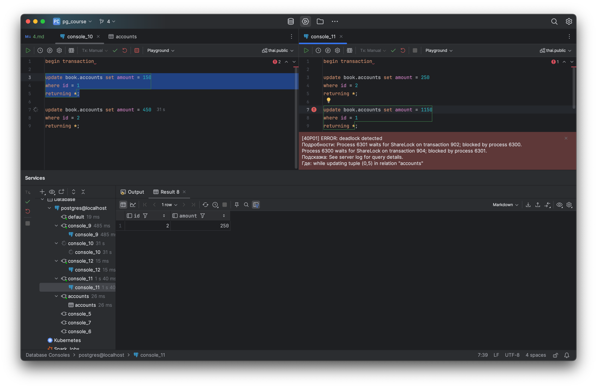

1. Создать таблицу accounts(id integer, amount numeric);
2. Добавить несколько записей и подключившись через 2 терминала добиться ситуации взаимоблокировки (deadlock).
```sql
begin transaction

update book.accounts set amount = 150
where id = 1
returning *;

update book.accounts set amount = 450
where id = 2
returning *;
```

```sql
begin transaction

update book.accounts set amount = 250
where id = 2
returning *;

update book.accounts set amount = 1150
where id = 1
returning *;
```
3. Посмотреть логи и убедиться, что информация о дедлоке туда попала.
```text
2024-10-16 21:31:15 2024-10-16 18:31:15.086 UTC [27] LOG:  checkpoint starting: time
2024-10-16 21:31:15 2024-10-16 18:31:15.214 UTC [27] LOG:  checkpoint complete: wrote 3 buffers (0.0%); 0 WAL file(s) added, 0 removed, 0 recycled; write=0.116 s, sync=0.005 s, total=0.129 s; sync files=2, longest=0.003 s, average=0.003 s; distance=0 kB, estimate=1419175 kB; lsn=22/766B9A60, redo lsn=22/766B9A08
2024-10-16 21:32:29 2024-10-16 18:32:29.987 UTC [6300] WARNING:  there is already a transaction in progress
2024-10-16 21:32:33 2024-10-16 18:32:33.280 UTC [6301] WARNING:  there is already a transaction in progress
2024-10-16 21:36:15 2024-10-16 18:36:15.319 UTC [27] LOG:  checkpoint starting: time
2024-10-16 21:36:15 2024-10-16 18:36:15.438 UTC [27] LOG:  checkpoint complete: wrote 2 buffers (0.0%); 0 WAL file(s) added, 0 removed, 0 recycled; write=0.114 s, sync=0.002 s, total=0.120 s; sync files=1, longest=0.002 s, average=0.002 s; distance=1 kB, estimate=1277258 kB; lsn=22/766B9FD0, redo lsn=22/766B9F58
2024-10-16 21:36:33 2024-10-16 18:36:33.833 UTC [6301] ERROR:  deadlock detected
2024-10-16 21:36:33 2024-10-16 18:36:33.833 UTC [6301] DETAIL:  Process 6301 waits for ShareLock on transaction 902; blocked by process 6300.
2024-10-16 21:36:33     Process 6300 waits for ShareLock on transaction 904; blocked by process 6301.
2024-10-16 21:36:33     Process 6301: update book.accounts set amount = 1150
2024-10-16 21:36:33     where id = 1
2024-10-16 21:36:33     returning *
2024-10-16 21:36:33     Process 6300: update book.accounts set amount = 450
2024-10-16 21:36:33     where id = 2
2024-10-16 21:36:33     returning *
2024-10-16 21:36:33 2024-10-16 18:36:33.833 UTC [6301] HINT:  See server log for query details.
2024-10-16 21:36:33 2024-10-16 18:36:33.833 UTC [6301] CONTEXT:  while updating tuple (0,5) in relation "accounts"
2024-10-16 21:36:33 2024-10-16 18:36:33.833 UTC [6301] STATEMENT:  update book.accounts set amount = 1150
2024-10-16 21:36:33     where id = 1
2024-10-16 21:36:33     returning *
2024-10-16 21:36:33 2024-10-16 18:36:33.850 UTC [6301] ERROR:  current transaction is aborted, commands ignored until end of transaction block
2024-10-16 21:36:33 2024-10-16 18:36:33.850 UTC [6301] STATEMENT:  select current_database() as a, current_schemas(false) as b
```
