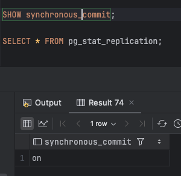
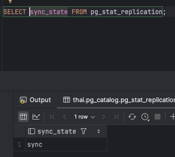

Развернуть асинхронную реплику (можно использовать 1 ВМ, просто рядом кластер развернуть и подключиться через localhost):
тестируем производительность по сравнению с сингл инстансом

Эталонного решения не будет, так как всё показано на лекции.

Задание со * переделать:
а) под синхронную реплику
б) синхронная реплика + асинхронная каскадно снимаемая с синхронной

Задание с **:
переделать скрипты для ВМ или докера из моей репы с pg_rewind под 17 ПГ
https://github.com/aeuge/pg_rewind

# решение

- поднять только мастер и залить в него бд
```text
task: [replicas:master:bench:run] time docker compose exec -it master sh -c "pgbench -c 8 -j 4 -T 60 -n -U postgres -p 5432 thai"
pgbench (17.0 (Debian 17.0-1.pgdg120+1))
transaction type: <builtin: TPC-B (sort of)>
scaling factor: 1
query mode: simple
number of clients: 8
number of threads: 4
maximum number of tries: 1
duration: 60 s
number of transactions actually processed: 320016
number of failed transactions: 0 (0.000%)
latency average = 1.500 ms
initial connection time = 3.237 ms
tps = 5333.703474 (without initial connection time)

real	1m0.129s
user	0m0.000s
sys	0m0.000s
task: [replicas:master:bench:run] time docker compose exec -it master sh -c "pgbench -c 8 -j 4 -T 60 -f ./write_load.sql -n -U postgres -p 5432 thai"
pgbench (17.0 (Debian 17.0-1.pgdg120+1))
transaction type: ./write_load.sql
scaling factor: 1
query mode: simple
number of clients: 8
number of threads: 4
maximum number of tries: 1
duration: 60 s
number of transactions actually processed: 1494058
number of failed transactions: 0 (0.000%)
latency average = 0.321 ms
initial connection time = 2.513 ms
tps = 24901.634445 (without initial connection time)

real	1m0.107s
user	0m0.000s
sys	0m0.000s
task: [replicas:master:bench:run] time docker compose exec -it master sh -c "pgbench -c 8 -j 4 -T 60 -f ./read_load.sql -n -U postgres -p 5432 thai"
pgbench (17.0 (Debian 17.0-1.pgdg120+1))
transaction type: ./read_load.sql
scaling factor: 1
query mode: simple
number of clients: 8
number of threads: 4
maximum number of tries: 1
duration: 60 s
number of transactions actually processed: 4320747
number of failed transactions: 0 (0.000%)
latency average = 0.111 ms
initial connection time = 2.607 ms
tps = 72015.061746 (without initial connection time)

real	1m0.107s
user	0m0.000s
sys	0m0.000s
```

- streaming replication
```postgresql
wal_level = 'replica'
hot_standby = 'on'
synchronous_commit = 'off'
hot_standby_feedback = 'on'
shared_buffers = '8GB'
effective_cache_size = '24GB'
work_mem = '115MB'
maintenance_work_mem = '2GB'
min_wal_size = '2GB'
max_wal_size = '3GB'
checkpoint_completion_target = '0.9'
wal_buffers = '-1'
listen_addresses = '*'
max_connections = '100'
random_page_cost = '1.1'
effective_io_concurrency = '200'
max_worker_processes = '8'
max_parallel_workers_per_gather = '2'
max_parallel_workers = '2'
```
```text
task: [replicas:master:bench:run] time docker compose exec -it master sh -c "pgbench -c 8 -j 4 -T 60 -n -U postgres -p 5432 thai"
pgbench (17.0 (Debian 17.0-1.pgdg120+1))
transaction type: <builtin: TPC-B (sort of)>
scaling factor: 1
query mode: simple
number of clients: 8
number of threads: 4
maximum number of tries: 1
duration: 60 s
number of transactions actually processed: 354148
number of failed transactions: 0 (0.000%)
latency average = 1.355 ms
initial connection time = 2.796 ms
tps = 5902.544384 (without initial connection time)

real	1m0.249s
user	0m0.000s
sys	0m0.000s
task: [replicas:master:bench:run] time docker compose exec -it master sh -c "pgbench -c 8 -j 4 -T 60 -f ./write_load.sql -n -U postgres -p 5432 thai"
pgbench (17.0 (Debian 17.0-1.pgdg120+1))
transaction type: ./write_load.sql
scaling factor: 1
query mode: simple
number of clients: 8
number of threads: 4
maximum number of tries: 1
duration: 60 s
number of transactions actually processed: 2417319
number of failed transactions: 0 (0.000%)
latency average = 0.199 ms
initial connection time = 2.549 ms
tps = 40288.535849 (without initial connection time)

real	1m0.114s
user	0m0.000s
sys	0m0.000s
task: [replicas:master:bench:run] time docker compose exec -it master sh -c "pgbench -c 8 -j 4 -T 60 -f ./read_load.sql -n -U postgres -p 5432 thai"
pgbench (17.0 (Debian 17.0-1.pgdg120+1))
transaction type: ./read_load.sql
scaling factor: 1
query mode: simple
number of clients: 8
number of threads: 4
maximum number of tries: 1
duration: 60 s
number of transactions actually processed: 4434598
number of failed transactions: 0 (0.000%)
latency average = 0.108 ms
initial connection time = 2.586 ms
tps = 73912.490778 (without initial connection time)

real	1m0.108s
user	0m0.000s
sys	0m0.000s
```

- синхронная реплика
```postgresql
# Do not edit this file manually!
# It will be overwritten by the ALTER SYSTEM command.
shared_buffers = '8GB'
effective_cache_size = '24GB'
work_mem = '115MB'
maintenance_work_mem = '2GB'
min_wal_size = '2GB'
max_wal_size = '3GB'
checkpoint_completion_target = '0.9'
wal_buffers = '-1'
listen_addresses = '*'
max_connections = '100'
random_page_cost = '1.1'
effective_io_concurrency = '200'
max_worker_processes = '8'
max_parallel_workers_per_gather = '2'
max_parallel_workers = '2'
wal_level = 'replica'
hot_standby = 'on'
synchronous_commit = 'on'
hot_standby_feedback = 'off'
synchronous_standby_names = 'FIRST 1 (replica1)'
```



```text
task: [replicas:master:bench:run] time docker compose exec -it master sh -c "pgbench -c 8 -j 4 -T 60 -n -U postgres -p 5432 thai"
pgbench (17.0 (Debian 17.0-1.pgdg120+1))
transaction type: <builtin: TPC-B (sort of)>
scaling factor: 1
query mode: simple
number of clients: 8
number of threads: 4
maximum number of tries: 1
duration: 60 s
number of transactions actually processed: 147936
number of failed transactions: 0 (0.000%)
latency average = 3.245 ms
initial connection time = 2.474 ms
tps = 2465.522665 (without initial connection time)

real	1m0.213s
user	0m0.000s
sys	0m0.000s
task: [replicas:master:bench:run] time docker compose exec -it master sh -c "pgbench -c 8 -j 4 -T 60 -f ./write_load.sql -n -U postgres -p 5432 thai"
pgbench (17.0 (Debian 17.0-1.pgdg120+1))
transaction type: ./write_load.sql
scaling factor: 1
query mode: simple
number of clients: 8
number of threads: 4
maximum number of tries: 1
duration: 60 s
number of transactions actually processed: 812894
number of failed transactions: 0 (0.000%)
latency average = 0.590 ms
initial connection time = 2.332 ms
tps = 13548.612469 (without initial connection time)

real	1m0.128s
user	0m0.000s
sys	0m0.000s
task: [replicas:master:bench:run] time docker compose exec -it master sh -c "pgbench -c 8 -j 4 -T 60 -f ./read_load.sql -n -U postgres -p 5432 thai"
pgbench (17.0 (Debian 17.0-1.pgdg120+1))
transaction type: ./read_load.sql
scaling factor: 1
query mode: simple
number of clients: 8
number of threads: 4
maximum number of tries: 1
duration: 60 s
number of transactions actually processed: 4241259
number of failed transactions: 0 (0.000%)
latency average = 0.113 ms
initial connection time = 3.024 ms
tps = 70690.353906 (without initial connection time)

real	1m0.131s
user	0m0.000s
sys	0m0.000s
```